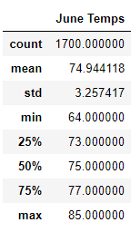
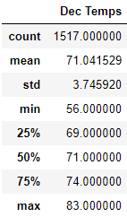

# surfs_up

## Resources

hawaii.sqlite database, python 3.7.9, jupyter notebook 6.1.4, sqlalchemy

## Overview

The purpose of this analysis is to examine past weather observations in Oahu to determine if the weather is consistent enough to support an ice cream and surfing goods shop year-round.  Multiple weather conditions including temperature and precepitation were observed and recorded for a period of seven years and stored in a SQLite database.  I queried the data base to get all the recorded temperatures in the month of June regardless of year, as well as all temperatures in December regardless of year.  I then converted those records to dataframes and produced summary statistics on the temperatures for each month as shown below.

## Results

- The mean and median temperatures are virtually equal in both months, indicating that the temperatures are fairly evenly distributed and not skewed to either side.  Also, the standard deviation for both months is fairly small, indicating most observed temeratures are are fairly stable around the mean temperature.  

- The minimum temperatures of 56 degrees in December and 64 in June are not terribly cold; similarly the maximum temperatures of 83 and 85 degrees respectivedly are not overly high.  Thus, even when the temperature does very outside the usually consistent mid 70s range from above, the temperatures are still reasonably comfortable and conducive to business.

- The mean temperatures in both months are very similar at about 74.9 degrees in June and 71 degrees in December.  This indicates that the weather is both comfortable and fairly consistentent between summer and winter months, allowing the shop to operate successfully year-round.

## Summary

In conclusion, the temperature data for June and December indicates that the temperature in Oahu is comfortable and consistent both in the summer and winter months.  Thus the temperature should be ideal for business year-round.

Further analysis could be done by querying both the months of June and December and the years from the database, rather than querying the months regardless of year.  Analyizing the temperatures by year for each month would demonstrate whether the temperatures have remained ideal and consistent over the years, or if in recent years the temperatures have begun to be more erratic due to climate change.

Analysis could also be done to determine if precipitation levels are as consistent as temperature by running similar queries for observed precipitation both by year and by months of June and December, and for those months regardless of year.